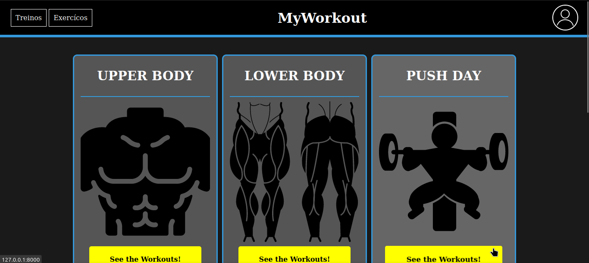
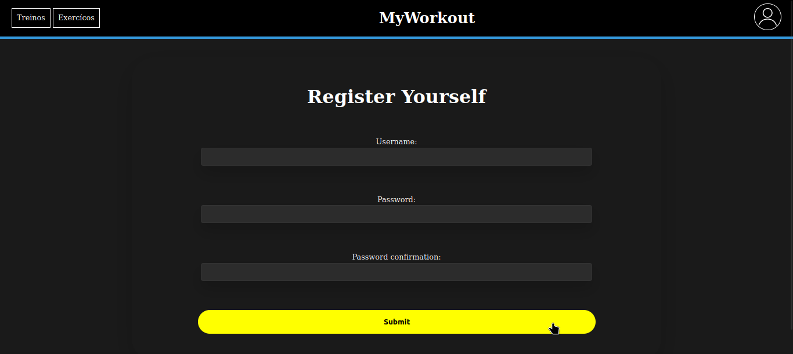

# MyWorkout

## What is this repo?

#### This repo is my personal project, and as you can see in the image below, we have some lists of workouts that the user can explore. 
#### At the moment (09 of Feb 2024) the project is just starting and don't have any functionalities. It just have a front-end.

##

## What is my purpose?

I think the best thing I know how to do in my life is train. I feel that i'm better at the gym than programmig. But i love the gym and i love to programming. So, my purpose here's to build a tool that can help other persons at the gym to train through the workouts maked by me. But of course, it's continues being just my personal project!

## Technologies used:
For being straight, this tool serves to improve my skills at **full stack development**. Because this site is being developed using:
- **Django**;
- **Python**;
- **Sqlite3**;
- **CSS**;
- **HTML**;
##
*I believe in the dream of being a **great** programmer!*