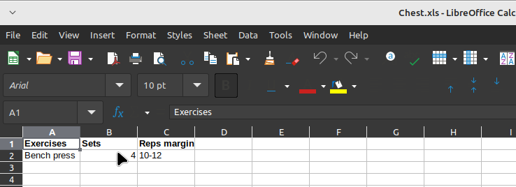

# MyWorkout

## What is this repo?(presentation)

#### This repo is my personal project, and as you can see in the image below, we have some lists of workouts that the user can explore. 

### - Homepage:

#### This project permite you to make your own workout by exercises selection with its sets. But before this, you have to create your account clicking in the user icon at the header:

### - Register form:

#### When you make your account, you'll be redirected to the user page:

### - User page:

## Making a workout:
#### Above you saw the link (button) "+ Add Workout" from user page. This link will appear when the authenticated user does not have a workout created, then, when you click in this link, you'll be redirected to the form that instances a Workout object:

### - Workout form:

#### You can set a name and select "Set exercise relationships"; this is a relation between the exercise selected with sets and its reps. In another words this is the code translation for a phrase like "4 sets of 10 to 12 reps on Bench press". For add a new relationship click in the green button '+' and a new page will be opened in the browser with the form:

### - Set x Exercise relationship form:

#### This object will be loaded in the form if you reload the workout form:

.png)

#### You can select multiple relationships and save. After that you can see your workouts on your user page and open a workout to see the list of exercises or you can download it clicking in the button:

### - Card workout (download):

#### Clicking in the button a file will be downloaded with the name of your workout and with the extension which you prefered. In this case, i wanted to download a file as a spreadsheet:

### - Workout spreadsheet:

## What is my purpose?

I think the best thing I know how to do in my life is to train. I feel that i'm better at the gym than programmig. But i love the gym and i love to programming. So, my purpose here's to build a tool that can help other persons at the gym to train through the workouts maked by me or yourself. But of course, it's continues being just my personal project! 

## Technologies used:
For being straight, this tool serves to improve my skills at **full stack development**. Because this site is being developed using:
- **Django 5**;
- **Python**;
- **Sqlite3**;
- **CSS**;
- **HTML**;
##
*I believe in the dream of being a **great** programmer!*